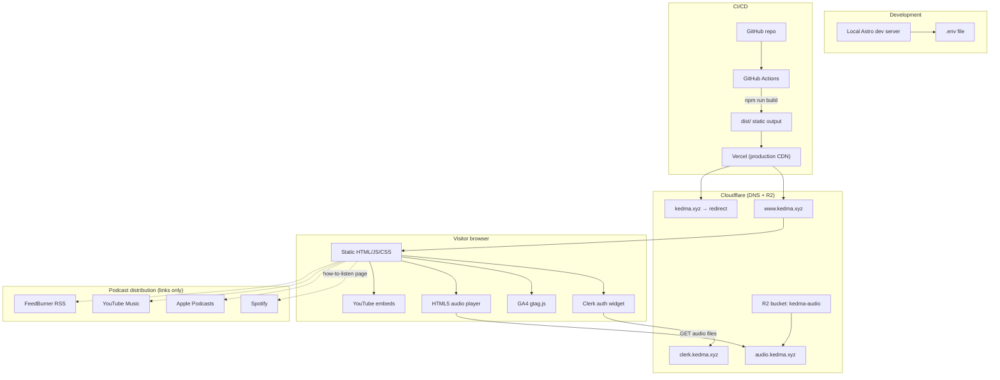

# Kedma — Architecture & Third-Party Services

This document describes the external services that power the [Kedma](https://www.kedma.xyz) podcast site, where to configure each one, and which environment variables the project expects.

**Live site:** [www.kedma.xyz](https://www.kedma.xyz)  
**Source:** [github.com/neshkoli/kedma](https://github.com/neshkoli/kedma)

---

## System overview

The site is a **static Astro app** built in CI and deployed to **Vercel**. Episode audio is hosted separately on **Cloudflare R2**. User sign-in (for gated features like episode download) runs through **Clerk**. Analytics go to **Google Analytics 4**.

---

## Third-party services

### Hosting & deployment

| Service | Role | Dashboard / admin |
|---------|------|-------------------|
| **GitHub** | Source control and CI trigger on push to `main` | [Repository](https://github.com/neshkoli/kedma) · [Actions](https://github.com/neshkoli/kedma/actions) · [Secrets & variables](https://github.com/neshkoli/kedma/settings/secrets/actions) |
| **Vercel** | Production CDN for the static site; apex → `www` redirect configured in `vercel.json` | [Vercel Dashboard](https://vercel.com/dashboard) · Project → **Settings** → **Environment Variables** |
| **GitHub Actions** | Builds the site (`npm run build`) and deploys prebuilt output via Vercel CLI | Workflow: [`.github/workflows/deploy.yml`](../.github/workflows/deploy.yml) |

Vercel Git auto-deploy is **disabled** (`vercel.json` → `git.deploymentEnabled: false`). Deployments are driven only by the GitHub Actions workflow.

---

### DNS & audio storage

| Service | Role | Dashboard / admin |
|---------|------|-------------------|
| **Cloudflare** | DNS for `kedma.xyz` and subdomains | [Cloudflare Dashboard](https://dash.cloudflare.com/) → select **kedma.xyz** → **DNS** |
| **Cloudflare R2** | Podcast audio files served at `https://audio.kedma.xyz/episodes/...` | [R2 overview](https://dash.cloudflare.com/?to=/:account/r2/overview) → bucket (e.g. `kedma-audio`) |

**R2 details**

- Object key pattern: `episodes/{YYYY}/{MM}/{slug}.{mp3|m4a}`
- Public access via custom domain `audio.kedma.xyz` (configured under bucket → **Settings** → **Public access** / **Custom Domains**)
- CORS policy for browser playback is defined in [`migration/r2-cors.json`](../migration/r2-cors.json) (allows `GET`/`HEAD` from `https://www.kedma.xyz` and `https://kedma.xyz`)
- Audio is **not** deployed by CI — upload via the local publisher (`npm run publish-episode`) or manually (dashboard, `wrangler`, or `rclone`)
- Local publisher: [`tools/episode-publisher/`](../tools/episode-publisher/) — binds to `127.0.0.1` only; not part of the Astro/Vercel build

---

### Authentication

| Service | Role | Dashboard / admin |
|---------|------|-------------------|
| **Clerk** | User sign-in (Hebrew UI); gates the per-episode **download** button in the audio player | [Clerk Dashboard](https://dashboard.clerk.com/) |
| **Google Cloud OAuth** | Google social login provider for Clerk (project: `kedma-podcast`) | [OAuth clients](https://console.cloud.google.com/auth/clients?project=kedma-podcast) · [Consent screen](https://console.cloud.google.com/auth/overview?project=kedma-podcast) |

**Clerk details**

- Astro integration: `@clerk/astro` in [`astro.config.mjs`](../astro.config.mjs), middleware in [`src/middleware.ts`](../src/middleware.ts)
- UI: [`src/components/ClerkAuth.astro`](../src/components/ClerkAuth.astro) (nav sign-in), [`src/components/AudioPlayer.astro`](../src/components/AudioPlayer.astro) (download gated with `<Show when="signed-in">`)
- Production Clerk Frontend API: `clerk.kedma.xyz` (custom domain in Clerk → **Domains**)
- Local dev keys: `clerk env pull` (see [Clerk Astro docs](https://clerk.com/docs/quickstarts/astro))
- Google OAuth wiring helper: [`scripts/configure-google-oauth-clerk.sh`](../scripts/configure-google-oauth-clerk.sh)

---

### Analytics

| Service | Role | Dashboard / admin |
|---------|------|-------------------|
| **Google Analytics 4** | Page views and custom audio events (`audio_play`, `audio_pause`, `audio_complete`, `file_download`) | [Google Analytics](https://analytics.google.com/) |

Implementation: [`src/components/Analytics.astro`](../src/components/Analytics.astro).  
Step-by-step setup: [`docs/google-analytics-setup.md`](./google-analytics-setup.md).

The measurement ID is baked in at **build time**. If unset, no analytics script is loaded.

---

### Typography (CDN)

| Service | Role | Dashboard / admin |
|---------|------|-------------------|
| **Google Fonts** | Loads Hanken Grotesk, Noto Sans Hebrew, and Noto Serif Hebrew in [`src/layouts/BaseLayout.astro`](../src/layouts/BaseLayout.astro) | [Google Fonts](https://fonts.google.com/) |

Display font **EFT Tamar** is self-hosted from `public/fonts/` (not a third-party service).

---

### Embedded media & podcast distribution

These services are referenced from episode content or the “how to listen” page. They are **not** configured via environment variables in this repo.

| Service | Role | Dashboard / admin |
|---------|------|-------------------|
| **YouTube** | Embedded `<iframe>` players in episode MDX (via [`src/plugins/remark-youtube-embed.mjs`](../src/plugins/remark-youtube-embed.mjs)) | [YouTube Studio](https://studio.youtube.com/) |
| **Spotify for Podcasters** | Podcast show and per-episode links in frontmatter / [how-to-listen](../src/pages/how-to-listen.astro) | [Spotify for Podcasters](https://podcasters.spotify.com/) |
| **Apple Podcasts** | Distribution link on how-to-listen page | [Apple Podcasts Connect](https://podcastsconnect.apple.com/) |
| **YouTube Music** | Playlist link on how-to-listen page | [YouTube Studio](https://studio.youtube.com/) |
| **FeedBurner** | Legacy RSS feed URL (`http://feeds.feedburner.com/kedma`) linked for subscribers | [FeedBurner](https://feedburner.google.com/) |

---

## Environment variables

Only **key names** are listed below — never commit secret values to git.

### Application & local development

Set these in a `.env` file (copy from [`.env.example`](../.env.example)):

| Variable | Required | Purpose |
|----------|----------|---------|
| `ASTRO_SITE` | No (defaults to `https://www.kedma.xyz`) | Canonical site URL for sitemaps, OG tags, and Astro `site` config |
| `ASTRO_BASE` | No (defaults to `/`) | Base path when the site is not served from domain root |
| `PUBLIC_GA_MEASUREMENT_ID` | No | GA4 measurement ID; enables analytics when set |
| `PUBLIC_CLERK_PUBLISHABLE_KEY` | Yes (for auth) | Clerk publishable key (`pk_test_` / `pk_live_`) |
| `CLERK_SECRET_KEY` | Yes (for auth middleware) | Clerk secret key (`sk_test_` / `sk_live_`); use `clerk env pull` locally |

`PUBLIC_*` variables are exposed to client-side code. All others are server/build-time only.

---

### GitHub Actions (production deploy)

Configured at **Settings → Secrets and variables → Actions**:

| Name | Type | Purpose |
|------|------|---------|
| `VERCEL_ORG_ID` | Secret | Vercel team/org identifier for CLI deploy |
| `VERCEL_PROJECT_ID` | Secret | Vercel project identifier |
| `VERCEL_TOKEN` | Secret | Vercel API token for `vercel deploy` |
| `PUBLIC_CLERK_PUBLISHABLE_KEY` | Secret | Clerk publishable key passed into the build |
| `PUBLIC_GA_MEASUREMENT_ID` | Variable | GA4 measurement ID passed into the build |

`ASTRO_SITE` and `ASTRO_BASE` are set inline in [`.github/workflows/deploy.yml`](../.github/workflows/deploy.yml) (not stored as repo secrets).

---

### Clerk Google OAuth setup (CLI tooling only)

Used by [`scripts/configure-google-oauth-clerk.sh`](../scripts/configure-google-oauth-clerk.sh) when wiring Google login — not read by the Astro app at runtime:

| Variable | Required | Purpose |
|----------|----------|---------|
| `GCP_PROJECT` | No (defaults to `kedma-podcast`) | Google Cloud project for OAuth client |
| `GOOGLE_CLIENT_ID` | Yes (for `apply` mode) | OAuth 2.0 Web client ID |
| `GOOGLE_CLIENT_SECRET` | Yes (for `apply` mode) | OAuth 2.0 client secret |

---

## Quick reference: what to configure where

| I want to… | Go to… |
|------------|--------|
| Change production deploy or domain on Vercel | [Vercel Dashboard](https://vercel.com/dashboard) |
| Rotate deploy tokens / CI secrets | [GitHub Actions secrets](https://github.com/neshkoli/kedma/settings/secrets/actions) |
| Upload or replace episode audio | [Cloudflare R2](https://dash.cloudflare.com/?to=/:account/r2/overview) |
| Fix DNS (www, audio, clerk subdomains) | [Cloudflare DNS](https://dash.cloudflare.com/) → kedma.xyz |
| Enable/disable sign-in, social providers, Hebrew copy | [Clerk Dashboard](https://dashboard.clerk.com/) |
| Add Google as a Clerk login provider | [Google OAuth clients](https://console.cloud.google.com/auth/clients?project=kedma-podcast) |
| View listen/download analytics | [Google Analytics](https://analytics.google.com/) |
| Update GA measurement ID for production | GitHub variable `PUBLIC_GA_MEASUREMENT_ID` + local `.env` |
| Publish to Spotify / Apple / YouTube Music | Respective podcast platform dashboards (links above) |

---

## Related docs

- [Google Analytics setup](./google-analytics-setup.md) — GA4 property, custom dimensions, and event verification
- [README](../README.md) — local development and content workflow
- [plan.md](../plan.md) — original migration spec (some items, e.g. Cusdis comments, were planned but are **not** implemented in the current codebase)
