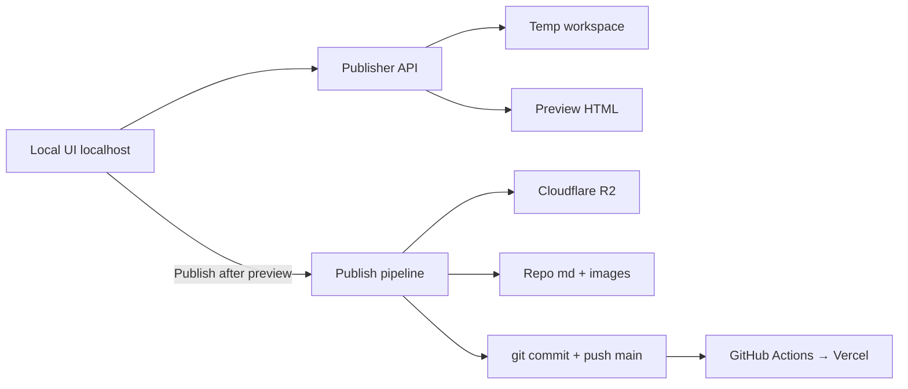

# Local Episode Publisher — Design

**Date:** 2026-08-11  
**Status:** Approved  
**Repo:** kedma (Astro static podcast site)

## Problem

Publishing a new Kedma episode today is manual and error-prone:

1. Write Markdown under `src/content/episodes/{YYYY}/{MM}/{N}.md`
2. Place images under `public/images/episodes/{YYYY}/{MM}/{N}/`
3. Upload MP3 to Cloudflare R2 at `episodes/{YYYY}/{MM}/{N}.mp3`
4. Commit and push to `main` so GitHub Actions deploys the site

There is no guided preview or single “publish” action.

## Goals

- Local-only web UI to create a new episode (never available in production deploy).
- Upload MP3, edit Markdown body, upload images (insert Markdown links).
- Collect full current frontmatter **except Spotify** (future phase).
- Auto-suggest next episode number and today’s year/month (editable).
- Derive `duration` from the MP3 file.
- Preview the episode before publish.
- Publish: upload audio to R2, write files into the repo, commit + push to `main`.

## Non-goals (this phase)

- Spotify for Creators (or other podcast-platform) publish integration.
- Editing or republishing existing episodes.
- Deploying the publisher with the Astro site / Vercel.
- Changing the public episode page design beyond what preview approximates.

## Approach

**Separate Node local app** under `tools/episode-publisher/`, started with:

```bash
npm run publish-episode
```

Own HTTP server bound to `127.0.0.1` only. Not imported by Astro, not referenced by CI, not included in `dist/`.

## Architecture

```
tools/episode-publisher/
  server.mjs              # localhost HTTP server + API
  public/                 # form UI + client-side preview
    index.html
    app.js
    styles.css
  lib/
    episode-paths.mjs     # next episode number, filesystem + R2 paths, slug
    duration.mjs          # probe MP3 duration → HH:MM:SS
    r2.mjs                # upload object to Cloudflare R2
    write-files.mjs       # write .md + images into repo paths
    git.mjs               # git add / commit / push
    frontmatter.mjs       # serialize episode frontmatter + body
```

Root `package.json` adds script `"publish-episode": "node tools/episode-publisher/server.mjs"`.

### Data flow



## UI / UX

### Form fields

| Field | Behavior |
|-------|----------|
| Episode number | Prefilled = max existing + 1; editable |
| Year / month | Prefilled from today; editable |
| Date | Prefilled today; editable |
| Title | Required |
| Cover image | Required upload; becomes frontmatter `image` |
| Image caption | Optional (`imageCaption`) |
| Period | Optional number (`period`) |
| Period name | Optional (`periodName`) |
| Tags | Optional list (comma or chip input) |
| Duration | Auto from MP3; shown read-only unless probe fails |
| Body Markdown | Required textarea |
| Audio (MP3) | Required file upload |
| Body images | Optional multi-upload; inserts `` at cursor |

No Spotify field in this phase.

### Flow

1. Open tool → form loads with suggested number/date paths.
2. Fill metadata, paste/edit Markdown, upload audio + images.
3. **Preview** renders an episode-like page (title, cover, local audio player, Markdown HTML, badges).
4. **Publish** enabled only after a successful preview in the current session (or explicit “I previewed” gate tied to last preview payload matching current form hash).
5. Confirm dialog → run publish pipeline → show progress and final links.

### Preview fidelity

Approximate the public episode page: Hebrew RTL, title, date, period/tag badges, hero image, audio controls, rendered Markdown body. Exact Astro/Tailwind parity is not required; clarity that content looks correct is required.

## Publish pipeline

Ordered steps; stop on first failure and report what already completed:

1. **Validate** — required fields, episode path not already taken (unless user confirms overwrite — default: refuse if `.md` exists), MP3 present.
2. **Upload R2** — key `episodes/{YYYY}/{MM}/{N}.mp3` (or `.m4a` if that extension is uploaded; prefer `.mp3`). Public URL: `https://audio.kedma.xyz/{key}`.
3. **Write images** — `public/images/episodes/{YYYY}/{MM}/{N}/` (cover + body images).
4. **Write Markdown** — `src/content/episodes/{YYYY}/{MM}/{N}.md` with frontmatter:
   - `title`, `date`, `slug` (`{YYYY}/{MM}/{N}.html`), `tags`, `image`, optional `imageCaption`, `audioUrl`, `audioFile` (original filename), `duration`, optional `period`, `periodName`
   - Body = editor Markdown (image paths already site-absolute under `/images/episodes/...`)
5. **Git** — `git add` only the new/changed episode paths → commit → `git push origin main`.
6. **Result** — episode path on site (`/{YYYY}/{MM}/{N}.html`), R2 URL, and note that deploy is via existing Actions.

### Commit message

Imperative, descriptive, e.g. `Add episode {N}: {title}`.

### Failure handling

- If R2 succeeds and git fails: keep R2 object; show remediation (retry git / delete R2 object manually).
- If files written but push fails: leave working tree committed or unpushed as reported; do not silently retry forever.
- Never push unrelated dirty files; stage only publisher outputs for this episode.

## Configuration

Local `.env` (document keys in `.env.example`; never commit secrets):

| Variable | Purpose |
|----------|---------|
| `R2_ACCOUNT_ID` | Cloudflare account id |
| `R2_ACCESS_KEY_ID` | R2 S3 API token id |
| `R2_SECRET_ACCESS_KEY` | R2 S3 API secret |
| `R2_BUCKET` | Bucket name (e.g. `kedma-audio`) |
| `R2_PUBLIC_BASE_URL` | Default `https://audio.kedma.xyz` |

Git authentication uses the operator’s existing local git credentials / `gh` / SSH — no GitHub token required in `.env` for the default design.

Server must refuse to listen on non-loopback addresses.

## Dependencies

Add only as needed for the tool (prefer root `devDependencies` or tool-local `package.json` — prefer **tool-local** if it keeps Astro deps clean):

- HTTP server (Node built-in `http` preferred to avoid Express unless needed)
- Multipart upload parsing
- Markdown → HTML for preview (e.g. `marked`)
- MP3 duration probe (e.g. `music-metadata`)
- AWS SDK v3 S3 client configured for R2 endpoint
- Optional: `simple-git` or spawn `git` CLI (prefer CLI for less deps)

## Security

- Bind `127.0.0.1` only.
- No auth beyond localhost assumption (single-operator machine).
- Do not log secret env values.
- Do not include publisher in Astro pages, middleware, or production build.

## Testing

- Unit-test path helpers (next episode number, slug, R2 key, image/md destinations).
- Unit-test frontmatter serialization against a fixture matching existing episode shape.
- Manual smoke: run publisher locally with a dry-run flag if implemented; otherwise test against a throwaway branch before first real `main` push (optional `PUBLISH_DRY_RUN=1` that skips R2+push but writes to a temp dir is recommended for safety during development).

## Future

- Spotify for Creators publish after site publish.
- Edit existing episode flow.
- Optional PR-based publish mode.

## Success criteria

- Operator can publish a new episode from one local UI without manually touching R2 dashboard or crafting paths.
- Production site build/deploy artifacts contain no publisher routes.
- After publish, `main` has the new `.md` + images, R2 serves the audio, and Actions deploys the site as today.
